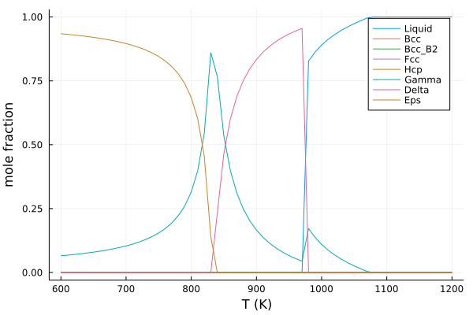

# Calmato

[](https://github.com/hasundue/Calmato.jl/actions?query=workflow%3ACI)
[](https://codecov.io/gh/hasundue/Calmato.jl)

**Calmato** is an open-source CALPHAD (CALculation of PHAse Diagrams) package in Julia language, which uses [**EAGO**](https://github.com/PSORLab/EAGO.jl) as its optimization engine. The package is still in the alpha stage of development and has limited functionality and reliability.

## Example

Let's take the Cu-Zn system assesed by [Liang et al. (2015)](https://www.sciencedirect.com/science/article/abs/pii/S0364591615300250) as an example.

Search and read the tdb file from [TDB DB](https://avdwgroup.engin.brown.edu/):

```julia
using Calmato

db = search_db("Cu Zn Liang Hsiao 2015")
```

```terminal
[1] Liang, Hsiao and Schmid-Fetzer (2015) Cu,Zn 
Database Summary:
        Elements: 4
        Functions: 10
        Phases: 8
```

Print contents of the database:

```julia
print(db)
```

```terminal
Database:
        Elements: 4
                /-
                VA
                Cu
                Zn
        Functions: 10
                RTLNP
                GHSERCU
                GHSERZN
                GLIQCU
                GBCCCU
                GHCPCU
                GLIQZN
                GBCCZN
                GFCCZN
                A1BCZ
        Phases: 8
                1: Liquid; (Cu,Zn)
                        G(Cu;0)
                        G(Zn;0)
                        L(Cu,Zn;0)
                        L(Cu,Zn;1)
                        L(Cu,Zn;2)
                2: Bcc; (Cu,Zn)
                        G(Cu;0)
                        G(Zn;0)
                        L(Cu,Zn;0)
                        L(Cu,Zn;1)
                        L(Cu,Zn;2)
                3: Bcc_B2; (Cu,Zn)0.5(Cu,Zn)0.5
                        ...
```

Initialize a system:

```julia
sys = init_system(db)
```

```terminal
System:
        Elements: 2
        Phases: 7
```
The init_system function automatically choose all the elements in the database except for electron gas (/-) and vacancy (VA) as components of the system:

Point calculation of an equilibrium state:

```julia
X = [0.3, 0.7]
T = 700 # K
equilib(sys, X, T)
```

```terminal
Gamma: 0.02890 mol
        Sublattice (Cu)4
                Cu: 1.0000
                Zn: 0.0000
        Sublattice (Cu,Zn)6
                Cu: 0.7363
                Zn: 0.2637
        Sublattice (Cu,Zn)16
                Cu: 0.0007
                Zn: 0.9993
Eps: 0.24864 mol
                Cu: 0.2269
                Zn: 0.7731
```

Calculation of equlibirum solidification, or the temperature dependence of phase constitution:

```julia
Ts = 600:10:1200
res = solidify(sys, X, Ts)
```

```terminal
Solidification:
        600 ≤ T ≤ 1200
        61 calculations
```

Calmato currently supports [**Plots**](https://github.com/JuliaPlots/Plots.jl) for visualization of results:

```julia
using Plots

plot(res)
```



## TODO

### Upcoming
- Magnetic contribution

### Near-future
- Improvement on calculation stability
- Database operations (edit, merge, export, etc.)
- Tests
- Documentation

### Faraway-future
- Phase diagram calculation
- GUI